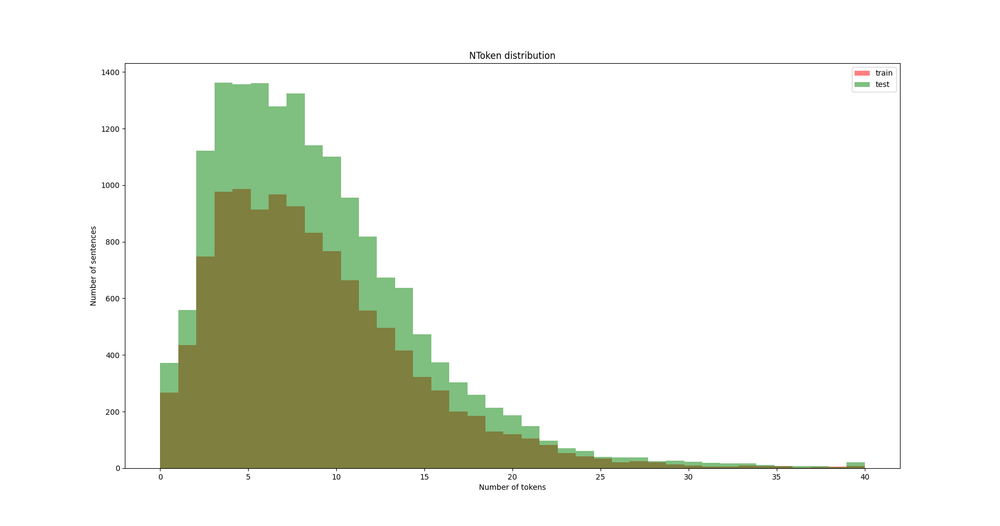

# Web document analysis

Проект по соревнованию на [kaggle](https://www.kaggle.com/competitions/anomaly-detection-competition-ml1-ts-autumn-2023/overview)


## Подготовка

1. Кладём в репозиторий данные в нужном формате:
```
data/  
    sample_submission.csv
    test_groups.csv  
    train_groups.csv
    docs_titles.tsv
    content/
           {^[0-9]+$}.dat
```

2. Меняем константы в [constants.py](./constants.py)


# Бейзлайны 


## Бейзлайны основанные на обработке только данных с title'ов 

[Препроцессим](pipelines%2Ftitles_preprocessing.py) простые данные (лейблов) (можно с лемматизацией или без), 
аккуратно склеиваем с train + test групами, складываем в отдельный csv-шник итоговый джойн
чтобы его таскать и не тратить время на обработку.

---



Обрезка до длины 40.

### SVM по title'ам

Идея: берём все тайтлы и создаём из них корпус, 
делаем TfIdf + TruncatedSVD на весь корпус, учим SVM.

#### метрики SVM по кросс-валидации
[Скрипт](./pipelines/svm/svm_titles_crossval.py) для кросс-валидации

| n_components | C in SVM | F1 on test          | F1 on train         |
|--------------|----------|---------------------|---------------------|
| 25           | 0.001    | 0.1727165832555488  | 0.26558814786900126 | 
| 25           | 0.01     | 0.5507886073712388  | 0.5599226853856151  | 
| 25           | 0.1      | 0.5969171351541723  | 0.6291994631395694  | 
| 25           | 1        | 0.5914141817410241  | 0.6577506589845903  | 
| 25           | 10       | 0.5419218536647635  | 0.712141936449977   | 
| 25           | 100      | 0.48676789722403857 | 0.7731278239493349  | 
| 25           | 1000     | 0.4630610033823933  | 0.8327784631757436  | 
| 50           | 0.001    | 0.4168354126232332  | 0.44551033578408583 | 
| 50           | 0.01     | 0.5723693878513292  | 0.5869101378712435  | 
| 50           | 0.1      | 0.6213041793126965  | 0.6561208528346018  | 
| 50           | 1        | 0.5793823857413047  | 0.6977104334062287  | 
| 50           | 10       | 0.43690059195108244 | 0.7792737614744663  | 
| 50           | 100      | 0.409404686320533   | 0.8487370409377979  | 
| 50           | 1000     | 0.4075340394619393  | 0.9073619180899415  | 
| 100          | 0.001    | 0.45634759657878166 | 0.4819992021978008  | 
| 100          | 0.01     | 0.5733033811696291  | 0.5874027125694135  | 
| 100          | 0.1      | 0.6327322622390879  | 0.6803251258184246  | 
| 100          | 1        | 0.5574859092635098  | 0.7434683961379955  | 
| 100          | 10       | 0.42872079408824415 | 0.8397432657214761  | 
| 100          | 100      | 0.3769822275059318  | 0.9023168660075918  | 
| 100          | 1000     | 0.35071819917120395 | 0.9498520270933983  | 
| 150          | 0.001    | 0.45375726002972067 | 0.4834670200756072  | 
| 150          | 0.01     | 0.5741441242430411  | 0.5885050093388922  | 
| 150          | 0.1      | 0.6315994762653379  | 0.6983875270340908  | 
| 150          | 1        | 0.5264664487316886  | 0.7721402985320639  | 
| 150          | 10       | 0.38931853363051216 | 0.867838783812425   | 
| 150          | 100      | 0.36213932578755936 | 0.9310985044848111  | 
| 150          | 1000     | 0.318809231340324   | 0.9664471040834004  | 
| 200          | 0.001    | 0.43432405030235177 | 0.46864506641655057 | 
| 200          | 0.01     | 0.573241027000172   | 0.5879818156792811  | 
| 200          | 0.1      | 0.6278410646675827  | 0.706312052380532   | 
| 200          | 1        | 0.4914551295121736  | 0.7907358731003925  | 
| 200          | 10       | 0.36573034931578297 | 0.8939676541971261  | 
| 200          | 100      | 0.35506804299471345 | 0.9463537246631006  | 
| 200          | 1000     | 0.3240737533687806  | 0.9755764270292963  | 
| 250          | 0.001    | 0.41277245158768705 | 0.4522942569425242  | 
| 250          | 0.01     | 0.5727866938977269  | 0.5894002591861673  | 
| 250          | 0.1      | 0.6292876746939463  | 0.7129713967724246  | 
| 250          | 1        | 0.46511629693158196 | 0.8037445333412603  | 
| 250          | 10       | 0.3758811417190343  | 0.9115866801329512  | 
| 250          | 100      | 0.34176853508033345 | 0.9579368033526248  | 
| 250          | 1000     | 0.3129933027808761  | 0.9807787955721367  | 
| 500          | 0.001    | 0.12340518186759937 | 0.20674355068118536 | 
| 500          | 0.01     | 0.5720749683181822  | 0.5880930935376105  | 
| 500          | 0.1      | 0.6302440457621203  | 0.7315263176885379  | 
| 500          | 1        | 0.3800173486934924  | 0.85166184105965    | 
| 500          | 10       | 0.28864728518832494 | 0.9512706892940888  | 
| 500          | 100      | 0.3032920288280881  | 0.9798051893743253  | 

Добавление лемматизации

| n_components | C in SVM | F1 on test           | F1 on train          |
|--------------|----------|----------------------|----------------------|
| 25           | 0.001    | 0.010521509283495507 | 0.008943332466506316 |
| 25           | 0.01     | 0.524290334960966    | 0.5252385231605088   |
| 25           | 0.1      | 0.6161732355815659   | 0.6227862980817673   |
| 25           | 1        | 0.6480717024526692   | 0.6711285250524561   |
| 25           | 10       | 0.656203310723509    | 0.7210569323852148   |
| 25           | 100      | 0.658575918001382    | 0.7765871388835864   |
| 25           | 1000     | 0.6505398474220881   | 0.834929094511474    |
| 50           | 0.001    | 0.45296964709283544  | 0.4540205689362885   |
| 50           | 0.01     | 0.574992558305753    | 0.5763896892358179   |
| 50           | 0.1      | 0.647414740429043    | 0.6564070304152134   |
| 50           | 1        | 0.6692748949193585   | 0.7049962661207648   |
| 50           | 10       | 0.6792182593358479   | 0.7775942715759342   |
| 50           | 100      | 0.6759440164600978   | 0.8541229704955094   |
| 50           | 1000     | 0.6601877702774299   | 0.908242784584164    |
| 100          | 0.001    | 0.5401467813021386   | 0.5420985308472842   |
| 100          | 0.01     | 0.5937706796283997   | 0.5978140581784265   |
| 100          | 0.1      | 0.678417594200899    | 0.6945527645913576   |
| 100          | 1        | 0.7091992560990801   | 0.7608908402915179   |
| 100          | 10       | 0.7126054370689863   | 0.8500199157882917   |
| 100          | 100      | 0.6887606361531468   | 0.9142656695262126   |
| 100          | 1000     | 0.6596897110039142   | 0.9525940834297302   |
| 150          | 0.001    | 0.5510140437729157   | 0.5523236380728773   |
| 150          | 0.01     | 0.6038758007209948   | 0.6072009884009577   |
| 150          | 0.1      | 0.6939521559182574   | 0.7130133246456287   |
| 150          | 1        | 0.7257086408368275   | 0.79074950715015     |
| 150          | 10       | 0.7228159854227252   | 0.8832230055965613   |
| 150          | 100      | 0.6999946244653998   | 0.9356195485989092   |
| 150          | 1000     | 0.6667149612719032   | 0.9690554122351642   |
| 200          | 0.001    | 0.5388990277801293   | 0.5384681643490898   |
| 200          | 0.01     | 0.6012994026809823   | 0.6053678719090707   |
| 200          | 0.1      | 0.702433113167459    | 0.7238236065950188   |
| 200          | 1        | 0.7357254938593704   | 0.8089007053431025   |
| 200          | 10       | 0.7362869238881206   | 0.9032188145220147   |
| 200          | 100      | 0.7101460034760878   | 0.9488126464046545   |
| 200          | 1000     | 0.6721624130418908   | 0.9765051359590217   |

#### Предикт при разных параметрах на test-сете

| k   | C     | normalize | Kaggle F1 score |
|-----|-------|-----------|-----------------|
| 100 | 0.1   | False     | 0.62736         |
| 50  | 1     | False     | 0.58873         |
| 100 | 10    | True      | 0.32102         |
| 200 | 0.1   | True      | 0.61975         |
| 200 | 0.001 | True      | 0.49302         |


## Бейзлайны основанные на использовании расширенной информации
 <...>